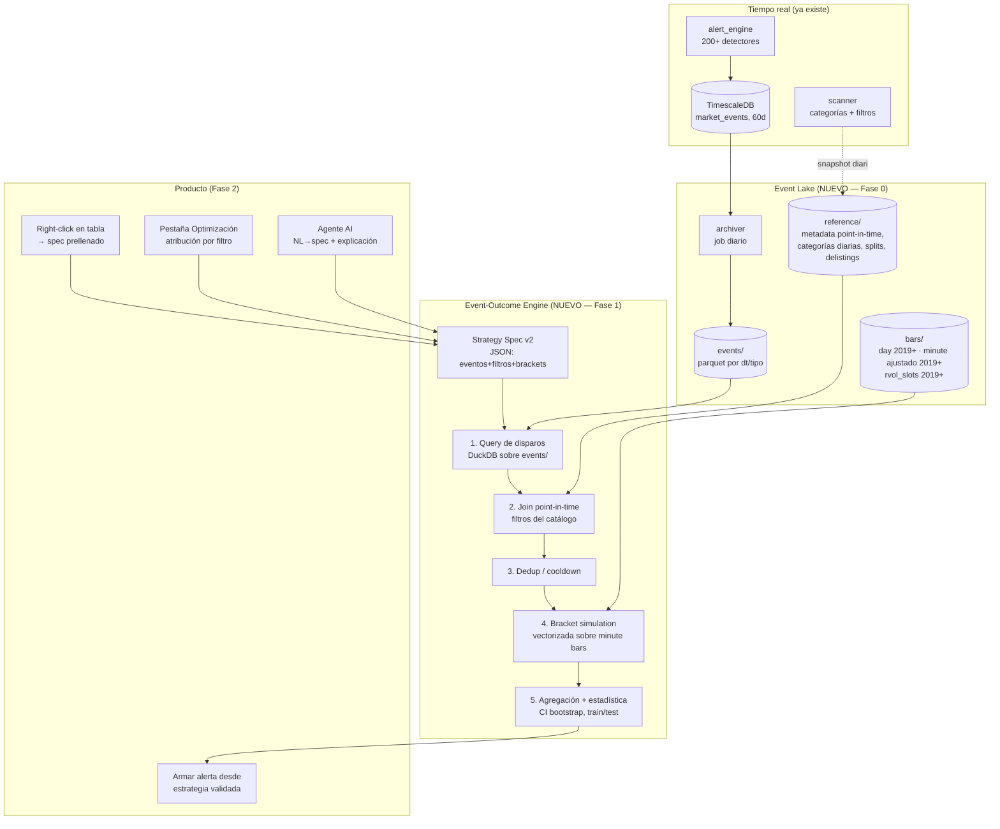

# Tradeul Backtester v2 — "Event Lab"
## Arquitectura completa: backtesting por eventos sobre el catálogo real de la plataforma

**Fecha:** 2026-07-23 · **Estado:** propuesta de diseño para revisión
**Contexto:** sustituye el diseño auditado el 2026-07-23 (motor no-portfolio incorrecto, catálogo reimplementado a mano, historia que se pierde a diario). Este documento define el sistema nuevo desde los datos hasta el producto.

---

## 0. La tesis: por qué esto será mejor que Trade Ideas

Trade Ideas OddsMaker (diseñado ~2005-2010) backtestea **recomputando** sus alertas sobre datos históricos con un motor propietario cerrado, ventanas cortas, estadística opaca (win rate sin intervalos de confianza), y optimización que invita al overfitting sin avisar.

Nuestra ventaja no es copiar eso con mejor UI. Es estructural:

1. **Nosotros ya detectamos los eventos de verdad.** El `alert_engine` produce ~12M eventos/día de 200+ tipos con el estado real del mercado en el momento del disparo (VWAP real de ticks, halts, microestructura bid/ask). Trade Ideas recomputa aproximaciones; nosotros **consultamos lo que realmente ocurrió**. Un backtest aquí responde literalmente "¿qué pasó las últimas N veces que sonó ESTA alerta con ESTOS filtros?" — la misma alerta, el mismo código detector, los mismos filtros que el usuario ve en su tabla.
2. **Point-in-time honesto.** Float, market cap, categoría del scanner, RVOL por slot — versionados por fecha. Trade Ideas (y el 90% de retail backtesters) filtran el pasado con datos de hoy. Nosotros no.
3. **Estadística de 2026, no de 2005.** Intervalos de confianza bootstrap en cada métrica, validación temporal automática (train/test), control de false discovery en la pestaña de optimización. Le decimos al usuario cuándo su "edge" es ruido — nadie en retail hace esto y es lo que convierte "juguete" en "herramienta profesional".
4. **Stack columnar moderno.** DuckDB + Parquet en NVMe local: escaneos de cientos de millones de eventos en sub-segundo, sin clúster, sin coste marginal. La tecnología que Trade Ideas no tenía disponible cuando se diseñó.
5. **AI nativo, no bolt-on.** Lenguaje natural → spec (pipeline ya construido en el agente), explicación de resultados en lenguaje de trader, y sugerencia activa de filtros a probar. Trade Ideas añadió "AI" como marketing sobre un motor viejo; aquí el agente y el motor comparten contrato.

**Principio rector:** *correcto por construcción*. Cada decisión de diseño de abajo existe para que sea imposible (no "improbable") el lookahead, el survivorship y la ambigüedad intrabar que invalidan el motor actual.

---

## 1. Vista de pájaro



Cuatro piezas, cuatro responsabilidades:

| Pieza | Responsabilidad | Regla de oro |
|---|---|---|
| **Event Lake** | Historia inmutable: eventos, referencia point-in-time, barras | Append-only. Nada se sobrescribe, nada se purga |
| **Event-Outcome Engine** | Spec → disparos → outcomes → estadística | Cada disparo es independiente. Sin estado compartido |
| **Catálogo unificado** | Una sola definición de filtros/eventos para scanner, tablas y backtester | El backtester no reimplementa: consume |
| **Producto** | Right-click, optimización, agente, armar alertas | Detección y validación hablan el mismo idioma |

---

## 2. Event Lake (Fase 0 — el prerequisito con coste de oportunidad diario)

### 2.1 `events/` — archivado del stream real

El alert_engine ya persiste a TimescaleDB con retención 60 días. Añadimos un **archiver** (job en `data_maintenance`, patrón ya existente en ese servicio) que cada noche exporta el día cerrado a Parquet:

```
/data/lake/events/dt=2026-07-23/event_type=vwap_cross_up/part-0.parquet
```

- **Particionado** por `dt` y `event_type`: los backtests filtran casi siempre por tipo y rango de fechas → partition pruning de DuckDB hace el resto.
- **Schema**: el de `market_events` + las columnas de contexto que el evento ya lleva (precio, volumen, rvol del momento, sesión). Congelamos el schema con una versión (`_schema_version`) para evolucionarlo sin romper lectores.
- **Compactación**: un fichero por partición y día (los 12M eventos/día ≈ 300–800 MB/día en Parquet comprimido con zstd; ~150–300 GB/año → trivial en NVMe, y particiones viejas pueden moverse a disco frío sin tocar el motor).
- **Backfill**: los 60 días vivos en TimescaleDB se exportan el primer día → el producto nace con 60 días de profundidad y crece a diario.
- **Idempotente y verificado**: cada export valida `count(parquet) == count(timescale)` para el día y escribe un manifiesto (`_manifest.json` con conteos y checksums). Si el job falla una noche, se reintenta sin duplicar.

### 2.2 `reference/` — point-in-time de verdad

| Dataset | Hoy | Fase 0 |
|---|---|---|
| `metadata/dt=YYYY-MM-DD/` | Snapshot único sobrescrito, sin fecha, solo activos | **Append diario** del snapshot completo (incl. float, mcap, sector, shares) SIN filtrar delistados. El join del motor siempre es `ASOF dt ≤ fecha_del_disparo` |
| `scanner_categories/dt=…` | No se persiste | Snapshot diario (cada N minutos si se quiere intradía) de ticker→categoría → habilita "backtestea los gappers_up" |
| `splits/`, `delistings/` | Splits ya cacheados | Se añade calendario de delistings (Polygon lo da) → el universo histórico incluye muertos |

Costes ridículos (el metadata son ~235 KB/día) y elimina el survivorship bias estructural para siempre — desde el día que se active.

### 2.3 `bars/` — completar lo que ya existe

- **Daily**: FLATS 2024-12→hoy ya operativos; backfill 2019+ desde el raw existente.
- **Minute ajustado**: hoy solo 6 semanas. Job batch que ajusta el raw 2019+ con el `split_adjuster` existente (correcto y testeado) → minuto completo 2019+. Es CPU-horas una vez, no diseño nuevo.
- **`rvol_slots/` (2019+, ya calculados, hoy huérfanos)**: se registran como tabla del lake y el motor los consume para RVOL intradía real ("RVOL a las 9:35 de aquel día"), en vez del proxy diario actual.

### 2.4 Por qué lake de Parquet y no "más TimescaleDB"

- El patrón de acceso del backtest es **analítico** (scan de millones de filas por tipo/fecha, agregaciones), no transaccional → columnar gana por >10×.
- DuckDB lee Parquet con partition pruning, predicate pushdown y paralelismo sin servidor que mantener; el mismo fichero lo puede leer el screener, un notebook, o Python del agente. Cero lock-in.
- TimescaleDB sigue siendo el buffer caliente de 60 días para tiempo real (strategy_scanner intradía de hoy) — no se toca. El lake es su memoria a largo plazo.

---

## 3. Strategy Spec v2 — el contrato de todo el sistema

Un único JSON que producen el right-click, la pestaña de optimización y el agente AI, y que consume el motor. Diseñado para que **la tabla del scanner sea serializable a spec sin traducción**.

```jsonc
{
  "spec_version": 2,
  "name": "Breakout con volumen en small caps",

  // QUÉ dispara — IDs del catálogo real (alert_types), no reimplementaciones
  "trigger": {
    "events": ["new_high_filtered", "volume_spike_1min"],
    "combine": "any",                  // any | all (ventana de coincidencia)
    "coincidence_window_s": 60,        // para "all": máx. distancia entre eventos
    "sequence": null                   // Fase 3: [{event, within_s, anchor}]
  },

  // CON QUÉ CONDICIONES — claves de filter_catalog.json, evaluadas point-in-time
  "filters": {
    "price": {"min": 2, "max": 20},
    "rvol_slot": {"min": 3},           // RVOL del slot del disparo (rvol_slots)
    "free_float": {"max": 50000000},   // del metadata point-in-time
    "session": ["regular"],            // premarket | regular | postmarket
    "time_of_day": {"from": "09:30", "to": "11:30"},
    "scanner_category": ["gappers_up"] // de scanner_categories point-in-time
  },

  // UNIVERSO
  "universe": {"method": "all", "exclude_delisted": false},

  // CÓMO SE OPERA cada disparo (brackets — se pueden pasar VARIOS para comparar)
  "execution": {
    "direction": "long",
    "entry": "next_bar_open",          // ÚNICO modo sin lookahead; no hay otro
    "cooldown_min": 15,                // no re-entrar en el mismo ticker antes de N min
    "max_signals_per_ticker_day": 3,
    "costs": {"slippage_model": "volume_based", "commission_per_trade": 0}
  },
  "exits": [
    {"stop_pct": 0.03, "target_pct": 0.06, "max_hold_min": 60, "eod_flat": true},
    {"stop_pct": 0.05, "target_pct": 0.10, "max_hold_min": 120, "eod_flat": true}
  ],

  // VENTANA
  "window": {"lookback_days": 60}       // o {from, to}
}
```

Decisiones de contrato (las importantes):

- **`entry` solo admite `next_bar_open`.** El spec no ofrece opciones con lookahead (el v1 permitía `open` de la barra de señal — entrada con datos del futuro). Lo incorrecto no se puede expresar.
- **Los filtros son claves del `filter_catalog.json`** (las 281 del scanner), no un set paralelo. El motor declara por introspección cuáles soporta y con qué fuente (evento / barras / referencia); el frontend pinta en gris las no soportadas aún, con el motivo. Nunca más un filtro que "funciona" devolviendo silenciosamente False.
- **Varios `exits` en un mismo run**: comparar brackets es el caso de uso nº1 del fine-tuning de salidas — se simulan en paralelo sobre los mismos disparos (coste marginal ≈ 0) y la UI los muestra lado a lado.
- **`sequence` reservado desde el día 1** (Fase 3) para no romper el contrato al añadir "A y luego B en N minutos".

---

## 4. Event-Outcome Engine (Fase 1)

### 4.1 Pipeline de ejecución (todo DuckDB + Arrow, un proceso)

```
spec ──► 1. TRIGGERS   SELECT sobre events/ (partition pruning por dt+tipo)
     ──► 2. ENRICH     ASOF JOIN con reference/ (float, mcap, categoría, rvol_slot)
     ──► 3. FILTER     WHERE con los filtros del spec (ya point-in-time)
     ──► 4. DEDUP      cooldown + max por ticker/día (window functions)
     ──► 5. SIMULATE   bracket sim vectorizada sobre minute bars
     ──► 6. AGGREGATE  métricas + bootstrap CI + split temporal train/test
```

**El paso 5 es el corazón y cabe en ~200 líneas correctas:** para cada disparo, localizar la barra de entrada (siguiente minuto al evento), y recorrer vectorizadamente las barras siguientes hasta el primer toque:

- **First-touch con high/low intrabar** (no "al close" como el v1): el stop se comprueba contra `low` (long), el target contra `high`.
- **Ambigüedad stop+target en la misma barra → política explícita y conservadora**: se asume que el stop se tocó primero (peor caso). Se reporta cuántos trades cayeron en esta ambigüedad; si supera un umbral, el resultado se marca "resolución de 1 min insuficiente" (honestidad > optimismo). *(Extensión futura: resolver con ticks para los ambiguos.)*
- **Gaps**: si la barra abre atravesando el stop/target, el fill es al `open` de esa barra (no al precio teórico) — como en la realidad.
- **Costes en cada lado**: se reutiliza el `fill_model` v1 (la pieza buena del sistema actual: impacto por volumen, partial fills, cap de participación).
- **Halts**: si hay evento `halt` del propio lake entre entrada y salida, la salida no puede ejecutarse durante el halt; se rellena a la reapertura. (Posible porque los halts son eventos reales del stream — el v1 los tenía como stub `False`.)
- **EOD flat** al último minuto de la sesión regular, con costes.

Cada disparo produce una fila: `{event_id, ticker, ts, entrada, salida, motivo_salida, retorno, MAE, MFE, barras_en_trade, hora}`. **MAE/MFE** (máxima excursión adversa/favorable) es lo que alimenta el fine-tuning de stops: "tus ganadores aguantaron -1.8% de media antes de girarse → tu stop de 1% te está echando de trades buenos".

### 4.2 Salida — métricas de trader con estadística honesta

- **Núcleo**: nº señales, win rate, profit factor, expectancy, avg win/loss, mejor/peor, distribución de retornos, **curva de resultado por hora del día** y por día de semana, curva MAE/MFE, tiempo medio al target/stop.
- **Por bracket** (si hay varios): tabla comparativa.
- **Incertidumbre en todo**: cada métrica lleva su IC 95% por bootstrap sobre los disparos (barato: son independientes). "Win rate 58% [51–65], n=214" comunica algo radicalmente distinto a "58%".
- **Validación temporal automática**: el motor SIEMPRE parte la ventana (p. ej. primeros 70% / últimos 30% de días) y reporta ambas. Degradación grande = bandera amarilla visible. Es el anti-overfitting estructural que Trade Ideas no tiene.
- **Sin métricas de cartera** (Sharpe/DD de equity): fuera del alcance de este motor por diseño. Si algún día se quiere "cartera", será otro módulo sobre estos mismos outcomes, con reloj único — no un bucle por ticker con estado compartido.

### 4.3 Rendimiento (presupuestos, no promesas)

| Escenario | Objetivo p95 |
|---|---|
| 1 tipo de evento + filtros, 60 días, market-wide | **< 2 s** |
| Lo mismo, 1 año | < 6 s |
| Pestaña optimización (20 variantes de filtros) | < 10 s (reusa disparos, ver §5) |
| Market-wide multi-evento 5 años | < 60 s, async con progreso |

Palancas: partition pruning (dt+tipo), NVMe local, **caché de disparos** clave `(events, window)` → los pasos 1-2 se reutilizan entre iteraciones de filtros (la optimización solo re-ejecuta 3-6), Arrow zero-copy entre pasos, y pre-agregados nocturnos para los eventos más consultados. DuckDB con `memory_limit` y jobs async (cola Redis ya existente) para lo grande.

### 4.4 Servicio

- FastAPI nuevo módulo `outcome/` dentro del backtester (convive con el v1 mientras migra).
- `POST /api/v2/backtest` (sync hasta 10 s, si no → job async con el sistema de colas existente, **arreglado**), `GET /api/v2/catalog` (eventos+filtros soportados, con introspección — el frontend se autoconfigura), `GET /api/v2/jobs/…`.
- **Auth desde el día 1** (mismo patrón de token interno que el mcp-gateway), límites de config **aplicados y testeados**, sin SQL crudo del cliente: el spec es declarativo y se compila a SQL parametrizado en el servidor.
- Telemetría con el patrón de la Fase 2 del agente (latencia por paso, cache hit rate, tamaño de resultado).

### 4.5 Tests de correctitud (lo que el v1 no tuvo)

- **Golden tests del bracket sim**: escenarios sintéticos con resultado calculado a mano — gap sobre el stop, stop+target misma barra, halt en medio, EOD, partial fill. Estos tests son el contrato del motor.
- Property-based: `retorno(long, stop tocado) ≤ 0` tras costes, MFE ≥ retorno final, etc.
- Test de no-lookahead: inyectar un dataset donde el futuro es distintivo y verificar que no se filtra.
- Paridad con producción: para un día reciente, los disparos del lake == las alertas que vieron los usuarios (validación del archiver, no del motor).

---

## 5. Pestaña de Optimización — "qué filtros aportan y cuáles restan"

Sobre el mismo motor, un runner de variantes:

1. **Atribución leave-one-out**: se re-ejecuta el spec quitando cada filtro (reusando el caché de disparos) → tabla "filtro → Δ expectancy, Δ n, Δ win rate" con IC. "El filtro float<50M te aporta +0.9% de expectancy; el de RSI te está quitando el 40% de las señales sin mejorar nada."
2. **Curvas de sensibilidad**: para filtros numéricos, sweep del umbral (rvol 1→10) → gráfico expectancy vs umbral con banda de confianza. Infinitamente más útil que on/off.
3. **Control de false discovery**: al probar N variantes, la significancia se ajusta (Benjamini-Hochberg) y el ranking marca cuáles sobreviven. El usuario ve "este ajuste es real / este es ruido de haber probado 30 cosas". **Esta es la feature que nos separa de todo el retail.**
4. **Siempre out-of-sample**: la recomendación se calcula en train y se muestra su comportamiento en test. Nunca se recomienda un ajuste que solo funciona in-sample.

---

## 6. Integración producto (Fase 2)

- **Right-click en cualquier tabla/alerta** → "Backtest this setup": la config de la tabla (tipo de evento + filtros activos, que ya son claves del catálogo) se serializa a spec, defaults sensatos de bracket, y se abre una floating window de resultados (el sistema de ventanas + maximizado ya existe). Un click, cero configuración.
- **Fine-tuning en el panel**: sliders de stop/target/hold que re-simulan al vuelo (los disparos están cacheados; solo se repite el paso 5 → sub-segundo). Este loop inmediato es la "mejora de decision-making speed" que pides.
- **Cerrar el círculo**: botón "armar alerta con esta config" → crea la alerta AI (sistema de alertas LLM ya existente) con los filtros validados. Detección → validación → vuelta a detección, sin salir del flujo.
- **Agente AI**: el nodo backtest del agente compila NL → spec v2 (pipeline defensivo ya construido, solo cambia el target), y el synthesizer explica resultados en lenguaje de trader, incluyendo las banderas de honestidad ("n bajo", "degrada out-of-sample").

---

## 7. Qué pasa con el motor v1

- **Modo template**: deprecado. El spec v2 lo cubre y lo supera; el bug async muere con él.
- **Modo código** (Python sandbox): se mantiene como escape hatch del agente para lógica arbitraria, apuntando a leer del lake (gana minuto 2019+ y eventos).
- **Se reutiliza**: `fill_model`, `split_adjuster`, `metrics.py` (las métricas por-trade), sistema de colas (arreglado), scripts de build de datos.
- **Se elimina**: `event_translator` (73 reimplementaciones → el lake), `filter_evaluator` (37 filtros → catálogo unificado), `_simulate` (el bucle no-portfolio), walk-forward y Monte Carlo actuales (sustituidos por train/test + bootstrap correctos).

---

## 8. Fases y esfuerzo

| Fase | Contenido | Esfuerzo estimado | Valor |
|---|---|---|---|
| **0 — Event Lake** | Archiver de eventos + backfill 60d, metadata point-in-time, categorías diarias, delistings, registro de rvol_slots | Días | **Compuesto diario** — cada día sin esto es historia perdida |
| **0.5 — Minuto histórico** | Batch de ajuste del raw 2019+ con split_adjuster | CPU-horas + supervisión | Habilita brackets en cualquier fecha |
| **1 — Engine** | Spec v2, pipeline DuckDB, bracket sim + golden tests, API v2 con auth/límites, caché de disparos | 1-2 semanas de trabajo enfocado | El producto core |
| **2 — Producto** | Right-click → panel de resultados, fine-tuning con sliders, pestaña optimización, agente a spec v2, armar alertas | 1-2 semanas | El flujo completo detección→validación |
| **3 — Secuencias** | `trigger.sequence` (A luego B en N s) — el lake ya tiene los timestamps; es SQL de ventanas + el mismo simulador | Días | Mata la última ventaja del strategy_scanner como silo |

Riesgos abiertos a vigilar: crecimiento del lake (mitigado: particiones frías a disco barato), calidad del backfill de minuto 2019+ (validar contra REST en muestras), y la tentación de re-añadir "métricas de cartera" al motor de outcomes (no — módulo aparte si algún día hace falta).

---

## 9. Resumen ejecutivo

Trade Ideas backtestea aproximaciones de sus alertas con estadística de hace 20 años. Nosotros vamos a backtestear **los eventos reales que nuestra plataforma ya detecta**, con filtros **point-in-time** del mismo catálogo que ve el usuario, simulación de brackets **correcta por construcción** (intrabar, conservadora, con costes y halts reales), estadística **honesta** (IC, train/test, control de false discovery) y un loop de fine-tuning **sub-segundo** integrado en el scanner con un right-click y con el agente AI como copiloto.

La única pieza con urgencia real es la Fase 0: el lake. Todo lo demás se puede iterar; la historia que no guardemos hoy no existe mañana.
